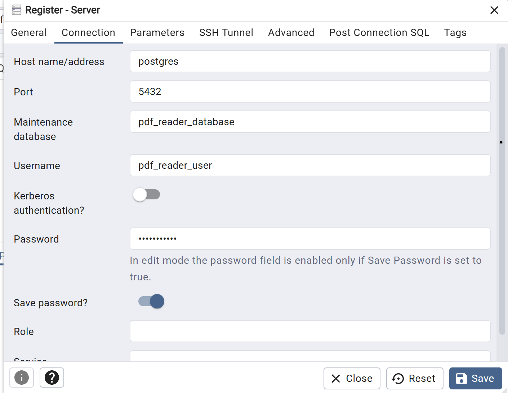

## Getting Started

### Prerequisites

```
  > Install Docker:
    https://docs.docker.com/desktop/setup/install/windows-install/


  > Install Docker-Compose: 
    https://docs.docker.com/compose/install/
```

### Running Development Environment

> After cloning the project, copy `env.template` as `.env`

> Update the variables in `.env`
  - create a Pinata account: https://app.pinata.cloud/auth/signup
  - create a Pinata API_KEY, API_SECRET, API_JWT and GATEWAY_URL

  - create OpenAI API key (note: you will need to add your credit card for billing before the API key is created or else you would need to regenerate the API Key)

  - default Postgresql and pgAdmin
  ```
    POSTGRES_USER=pdf_reader_user
    POSTGRES_DB=pdf_reader_database
    POSTGRES_PASSWORD=hello_world
    POSTGRES_PORT=5432

    PGADMIN_MAIL=a@a.com
    PGADMIN_PASSWORD=asdf1234
    PGADMIN_PORT=5050

  ```


> Navigate to the project folder and run: `docker-compose up -d`

> Run `npm install`
  - note: after installing node_modules, `postinstall` will create the DB tables. You can also push to database by running `npm run db_dev:push`

> Run `npm run dev`


### Connecting to pgAdmin

pgAdmin will be running inside a Docker Container and it is running on `PGADMIN_PORT` (default: 5050).

To access pgAdmin go to localhost:{PGADMIN_PORT} (ex: localhost:5050)


To sign, the credentails are `PGADMIN_MAIL` and `PG_PASSWORD`

To connect to the Database:
> On the `Object Explorer`, right click on `Servers` > `Register` > `Server...`

> Enter a Name on General Tab

> On Connection Tab, the hostname will be `postgres` (the name of the docker container), Maintenance database=POSTGRES_DB, Username=POSTGRES_USER, Password=POSGRES_PASSWORD. 

-------------------------------------------

